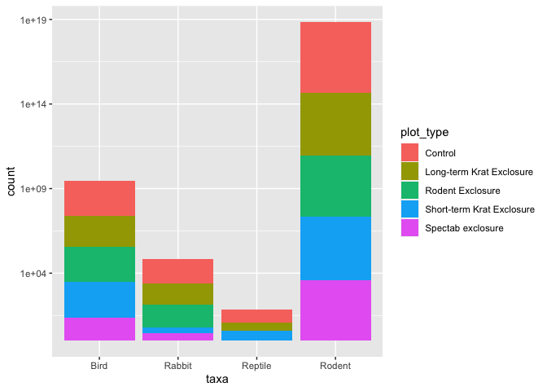
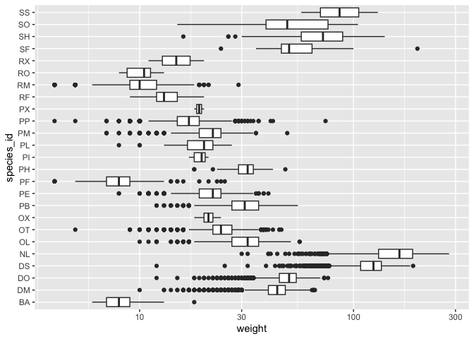
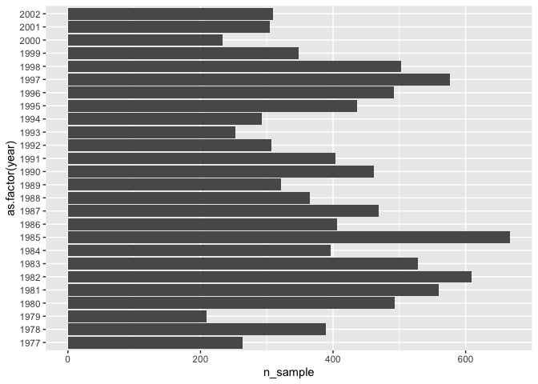
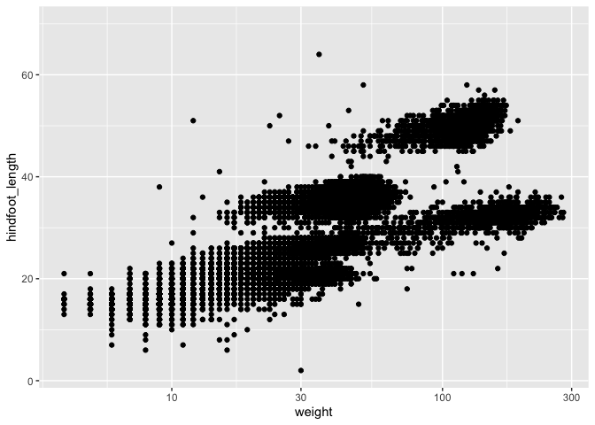
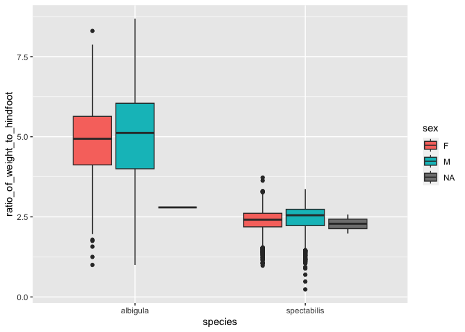
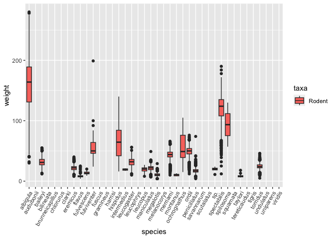

## Instructions
Answer the following questions and complete the exercises in RMarkdown. Please embed all of your code and push your final work to your repository. Your final lab report should be organized, clean, and run free from errors. Remember, you must remove the `#` for the included code chunks to run. Be sure to add your name to the author header above. For any included plots, make sure they are clearly labeled. You are free to use any plot type that you feel best communicates the results of your analysis.  

Make sure to use the formatting conventions of RMarkdown to make your report neat and clean!  

## Load the libraries

```r
library(tidyverse)
library(janitor)
library(here)
library(naniar)
```

## Desert Ecology
For this assignment, we are going to use a modified data set on [desert ecology](http://esapubs.org/archive/ecol/E090/118/). The data are from: S. K. Morgan Ernest, Thomas J. Valone, and James H. Brown. 2009. Long-term monitoring and experimental manipulation of a Chihuahuan Desert ecosystem near Portal, Arizona, USA. Ecology 90:1708.

```r
deserts <- read_csv(here("data", "surveys_complete.csv"))
```

```
## Rows: 34786 Columns: 13
## ── Column specification ────────────────────────────────────────────────────────
## Delimiter: ","
## chr (6): species_id, sex, genus, species, taxa, plot_type
## dbl (7): record_id, month, day, year, plot_id, hindfoot_length, weight
## 
## ℹ Use `spec()` to retrieve the full column specification for this data.
## ℹ Specify the column types or set `show_col_types = FALSE` to quiet this message.
```

1. Use the function(s) of your choice to get an idea of its structure, including how NA's are treated. Are the data tidy?  


```r
glimpse(deserts)
```

```
## Rows: 34,786
## Columns: 13
## $ record_id       <dbl> 1, 2, 3, 4, 5, 6, 7, 8, 9, 10, 11, 12, 13, 14, 15, 16,…
## $ month           <dbl> 7, 7, 7, 7, 7, 7, 7, 7, 7, 7, 7, 7, 7, 7, 7, 7, 7, 7, …
## $ day             <dbl> 16, 16, 16, 16, 16, 16, 16, 16, 16, 16, 16, 16, 16, 16…
## $ year            <dbl> 1977, 1977, 1977, 1977, 1977, 1977, 1977, 1977, 1977, …
## $ plot_id         <dbl> 2, 3, 2, 7, 3, 1, 2, 1, 1, 6, 5, 7, 3, 8, 6, 4, 3, 2, …
## $ species_id      <chr> "NL", "NL", "DM", "DM", "DM", "PF", "PE", "DM", "DM", …
## $ sex             <chr> "M", "M", "F", "M", "M", "M", "F", "M", "F", "F", "F",…
## $ hindfoot_length <dbl> 32, 33, 37, 36, 35, 14, NA, 37, 34, 20, 53, 38, 35, NA…
## $ weight          <dbl> NA, NA, NA, NA, NA, NA, NA, NA, NA, NA, NA, NA, NA, NA…
## $ genus           <chr> "Neotoma", "Neotoma", "Dipodomys", "Dipodomys", "Dipod…
## $ species         <chr> "albigula", "albigula", "merriami", "merriami", "merri…
## $ taxa            <chr> "Rodent", "Rodent", "Rodent", "Rodent", "Rodent", "Rod…
## $ plot_type       <chr> "Control", "Long-term Krat Exclosure", "Control", "Rod…
```


2. How many genera and species are represented in the data? What are the total number of observations? Which species is most/ least frequently sampled in the study?


```r
deserts %>% 
  summarize(n_distinct(genus))
```

```
## # A tibble: 1 × 1
##   `n_distinct(genus)`
##                 <int>
## 1                  26
```


```r
deserts %>% 
  summarize(n_distinct(species))
```

```
## # A tibble: 1 × 1
##   `n_distinct(species)`
##                   <int>
## 1                    40
```


```r
deserts %>% 
  count(genus)
```

```
## # A tibble: 26 × 2
##    genus                n
##    <chr>            <int>
##  1 Ammodramus           2
##  2 Ammospermophilus   437
##  3 Amphispiza         303
##  4 Baiomys             46
##  5 Calamospiza         13
##  6 Callipepla          16
##  7 Campylorhynchus     50
##  8 Chaetodipus       6029
##  9 Cnemidophorus        2
## 10 Crotalus             2
## # … with 16 more rows
```


```r
deserts %>% 
  count(species) %>% 
  arrange(n)
```

```
## # A tibble: 40 × 2
##    species          n
##    <chr>        <int>
##  1 clarki           1
##  2 scutalatus       1
##  3 tereticaudus     1
##  4 tigris           1
##  5 uniparens        1
##  6 viridis          1
##  7 leucophrys       2
##  8 savannarum       2
##  9 fuscus           5
## 10 undulatus        5
## # … with 30 more rows
```

The most sampled species is merriami.  

3. What is the proportion of taxa included in this study? Show a table and plot that reflects this count.


```r
deserts %>% 
  count(taxa)
```

```
## # A tibble: 4 × 2
##   taxa        n
##   <chr>   <int>
## 1 Bird      450
## 2 Rabbit     75
## 3 Reptile    14
## 4 Rodent  34247
```


```r
deserts %>% 
  ggplot(aes(x=taxa)) +
  geom_bar()+
  scale_y_log10()
```

<!-- -->


4. For the taxa included in the study, use the fill option to show the proportion of individuals sampled by `plot_type.`


```r
deserts %>% 
  ggplot(aes(x=taxa, fill = plot_type)) +
  geom_bar()+
  scale_y_log10()
```

<!-- -->


5. What is the range of weight for each species included in the study? Remove any observations of weight that are NA so they do not show up in the plot.


```r
deserts %>%
  filter(weight!="NA") %>% 
  ggplot(aes(x=species_id, y=weight))+
  geom_boxplot()+
  coord_flip()+
  scale_y_log10()
```

<!-- -->


6. Add another layer to your answer from #4 using `geom_point` to get an idea of how many measurements were taken for each species.


```r
deserts %>% 
  ggplot(aes(x=taxa, fill = plot_type)) +
  geom_bar()+
  scale_y_log10()
```

<!-- -->


7. [Dipodomys merriami](https://en.wikipedia.org/wiki/Merriam's_kangaroo_rat) is the most frequently sampled animal in the study. How have the number of observations of this species changed over the years included in the study?


```r
deserts %>% 
  filter(species_id == "DM") %>% 
  group_by(year) %>% 
  summarize(n_sample = n()) %>% 
  ggplot(aes(x=as.factor(year), y = n_sample))+
  geom_col()+
  coord_flip()
```

<!-- -->


8. What is the relationship between `weight` and `hindfoot` length? Consider whether or not over plotting is an issue.


```r
deserts %>%
  ggplot(aes(x=weight, y=hindfoot_length))+
  geom_point()+
  scale_x_log10()
```

```
## Warning: Removed 4048 rows containing missing values (`geom_point()`).
```

<!-- -->


9. Which two species have, on average, the highest weight? Once you have identified them, make a new column that is a ratio of `weight` to `hindfoot_length`. Make a plot that shows the range of this new ratio and fill by sex.


```r
deserts %>% 
  filter(weight != "NA") %>% 
  group_by(species) %>% 
  summarize(average_weight = mean(weight)) %>% 
  arrange(desc(average_weight))
```

```
## # A tibble: 22 × 2
##    species      average_weight
##    <chr>                 <dbl>
##  1 albigula              159. 
##  2 spectabilis           120. 
##  3 spilosoma              93.5
##  4 hispidus               65.6
##  5 fulviventer            58.9
##  6 ochrognathus           55.4
##  7 ordii                  48.9
##  8 merriami               43.2
##  9 baileyi                31.7
## 10 leucogaster            31.6
## # … with 12 more rows
```


```r
ratio <- deserts %>% 
  filter(species == "albigula" | species == "spectabilis") %>% 
  mutate(ratio_of_weight_to_hindfoot = weight/hindfoot_length)
ratio
```

```
## # A tibble: 3,756 × 14
##    record…¹ month   day  year plot_id speci…² sex   hindf…³ weight genus species
##       <dbl> <dbl> <dbl> <dbl>   <dbl> <chr>   <chr>   <dbl>  <dbl> <chr> <chr>  
##  1        1     7    16  1977       2 NL      M          32     NA Neot… albigu…
##  2        2     7    16  1977       3 NL      M          33     NA Neot… albigu…
##  3       11     7    16  1977       5 DS      F          53     NA Dipo… specta…
##  4       17     7    16  1977       3 DS      F          48     NA Dipo… specta…
##  5       20     7    17  1977      11 DS      F          48     NA Dipo… specta…
##  6       22     7    17  1977      15 NL      F          31     NA Neot… albigu…
##  7       30     7    17  1977      10 DS      F          52     NA Dipo… specta…
##  8       38     7    17  1977      17 NL      M          33     NA Neot… albigu…
##  9       42     7    18  1977      18 DS      F          46     NA Dipo… specta…
## 10       58     7    18  1977      12 DS      M          45     NA Dipo… specta…
## # … with 3,746 more rows, 3 more variables: taxa <chr>, plot_type <chr>,
## #   ratio_of_weight_to_hindfoot <dbl>, and abbreviated variable names
## #   ¹​record_id, ²​species_id, ³​hindfoot_length
```


```r
ratio %>% 
  ggplot(aes(x=species, y=ratio_of_weight_to_hindfoot, fill = sex))+
  geom_boxplot()
```

```
## Warning: Removed 684 rows containing non-finite values (`stat_boxplot()`).
```

<!-- -->


10. Make one plot of your choice! Make sure to include at least two of the aesthetics options you have learned.


```r
deserts %>% 
  ggplot(aes(x = species, y = weight, fill = taxa)) +
  geom_boxplot()+
  theme(axis.text.x = element_text(angle = 60, hjust = 1))
```

```
## Warning: Removed 2503 rows containing non-finite values (`stat_boxplot()`).
```

<!-- -->


## Push your final code to GitHub!
Please be sure that you check the `keep md` file in the knit preferences. 
